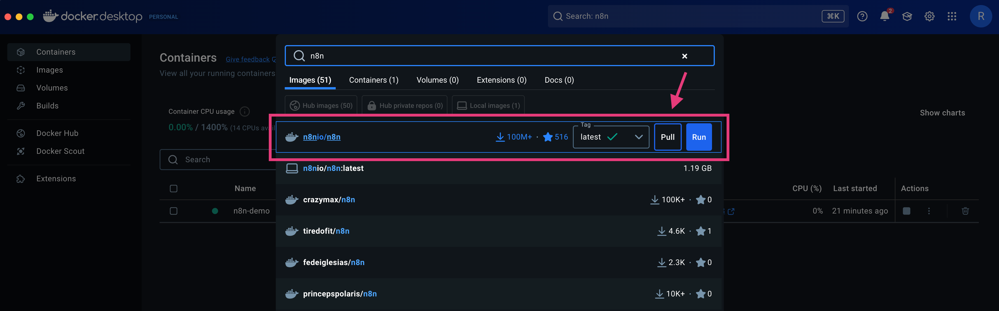
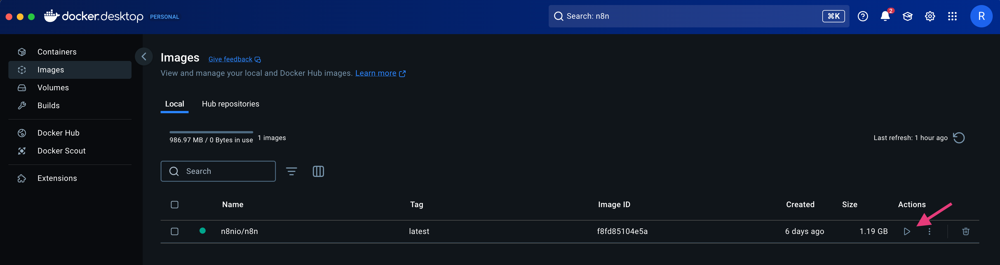
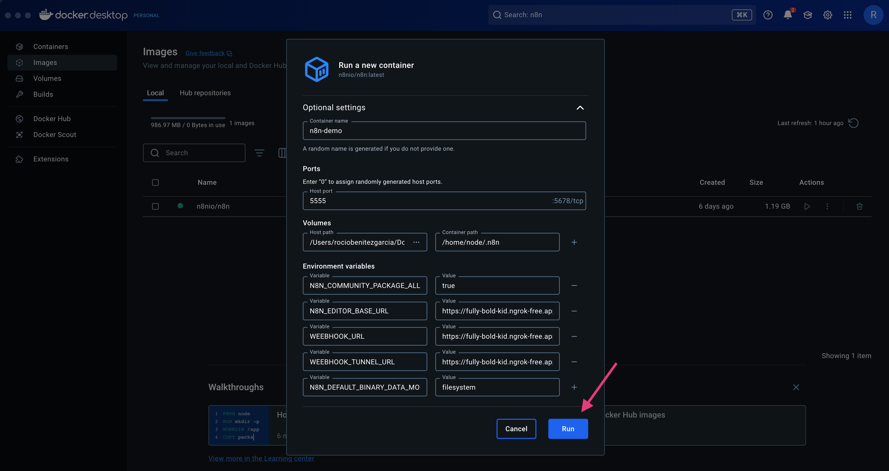
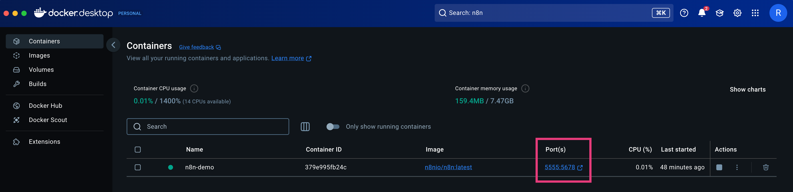
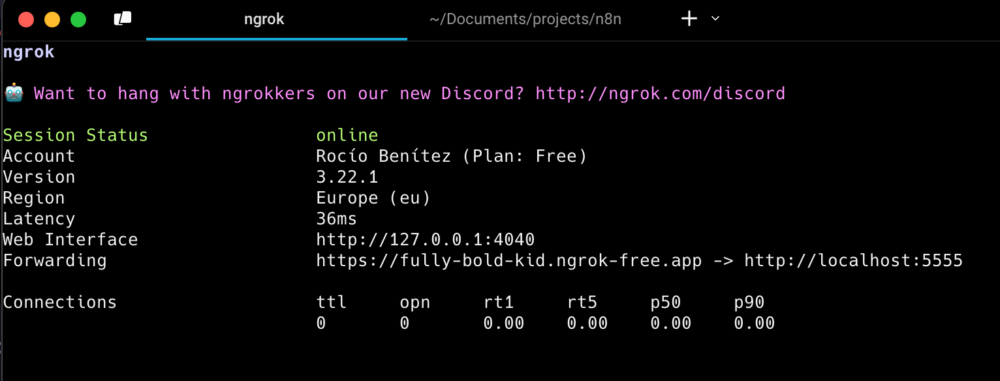
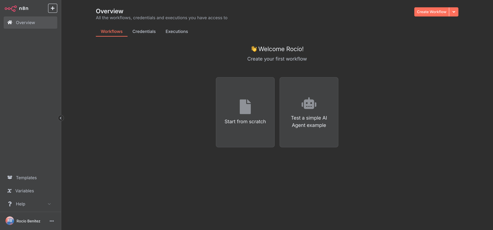

# n8n Self-Hosted con Docker y Ngrok

Esta guía describe cómo configurar una instancia de n8n autoalojada utilizando Docker y Ngrok, permitiendo ejecutar n8n localmente sin necesidad de un servidor dedicado.

## Requisitos

- [Docker](https://www.docker.com/products/docker-desktop/)
- [Ngrok](https://ngrok.com/)
- [Homebrew](https://brew.sh/) (solo macOs)

## 1. Instalar Nngrok

Para [instalar Ngrok](https://dashboard.ngrok.com/get-started/setup/macos) en macOS:

```bash
brew install ngrok
```

Autentica tu cuenta en Ngrok:

```bash
ngrok config add-authtoken <tu_authtoken>
```

## 2. Crear un túnel con Ngrok

Elige **Static Domain** para desplegar la aplicación online:

```
ngrok http --url=<tu_subdominio>.ngrok-free.app 80
```

Anota la URL proporcionada por Ngrok (por ejemplo, `https://<subdominio>.ngrok-free.app`).

## 3. Configurar Docker para n8n

**Crea un directorio para tu proyecto y entrar en él:**

```bash
mkdir ~/n8n
cd ~/n8n
```

**Descarga la imagen de `n8n` desde Docker:**

- Abre **Docker Desktop** y ve a la pestaña **Images**.
- Busca la imagen oficial de n8n (`n8nio/n8n`) y haz clic en **Pull** para descargarla.

  

- Crea, dentro del directorio del proyecto, la carpeta `volume`.

  ```bash
  mkdir ~/n8n/volume
  ```

**Configura el contenedor con variables de entorno personalizadas:**

- Haz clic en **Run** para generar un contenedor basado en la imagen n8nio/n8n.

  

- En la ventana de configuración avanzada, especifica las siguientes opciones:

  

  - **Nombre del contenedor:** `n8n-demo` _(puedes cambiarlo por el nombre que prefieras)_
  - **Puerto (Ports):** Asocia el puerto 5555 del contenedor con el puerto 5555 de tu máquina local (esto permitirá acceder a la app a través de localhost:5555).
  - **Volúmenes (Volumes):**

    - En **Host path**, selecciona la carpeta que has creado previamente (`~/n8n/volume`).
    - En **Container path**, ingresa la ruta `/home/node/.n8n` para que los datos de n8n se almacenen en el volumen.

  - **Variables de entorno (Environment variables):**

    - `N8N_COMMUNITY_PACKAGES_ALLOW_TOOL_USAGE=true`
    - `N8N_EDITOR_BASE_URL=https://<tu_subdominio_ngrok>.ngrok-free.app` _(Reemplaza `<tu_subdominio_ngrok>` por el subdominio que Ngrok te proporciona)_
    - `WEBHOOK_URL=https://<tu_subdominio_ngrok>.ngrok-free.app`
    - `WEEBHOOK_TUNNEL_URL=https://<tu_subdominio_ngrok>.ngrok-free.app`
    - `N8N_DEFAULT_BINARY_DATA_MODE=filesystem`

    <br>
    > [!NOTE]
    > Es importante añadir `https://` al inicio de las URLs y asegurarte de poner el dominio proporcionado por Ngrok.

    <br>

- Haz clic en **Run** para crear el contenedor y ejecutarlo.



### Alternativa: Uso de Docker Compose para configurar n8n

Si prefieres gestionar tu instancia de n8n utilizando [Docker Compose](https://docs.docker.com/compose/), puedes optar por esta alternativa para simplificar la gestión de los contenedores. **Docker Compose** es una herramienta que permite definir y ejecutar aplicaciones multicontenedor, utilizando un archivo YAML que describe los servicios, redes y volúmenes involucrados.

En lugar de gestionar los contenedores de Docker **manualmente** mediante la interfaz gráfica de _Docker Desktop_, Docker Compose permite **definir todos los parámetros de configuración** (como puertos, volúmenes y variables de entorno) en un solo archivo `docker-compose.yml`. Este archivo facilita la creación, inicio, detención y escalabilidad de los contenedores con un solo comando.

**Uso de Docker Compose:** Una vez que tengas `docker-compose.yml`, puedes iniciar el contenedor de n8n con el siguiente comando desde el directorio donde se encuentra este archivo:

```bash
docker-compose up -d
```

Este comando descargará la imagen de n8n (si no la tienes), creará el contenedor según las configuraciones especificadas y lo iniciará en segundo plano.

## 4. Desplegar la aplicación con Ngrok

Abre la terminal y ejecuta el siguiente comando para exponer el puerto 5555 (o el que hayas especificado) de tu máquina local a Internet a través de Ngrok:

```bash
ngrok http --url=<tu_subdominio_ngrok>.ngrok-free.app 5555
```

> [!NOTE]
> Asegúrate de usar el mismo puerto que configuraste en el contenedor (en este caso, 5555).

Después de ejecutar el comando, Ngrok te proporcionará una URL (por ejemplo, https://`<tu_subdominio_ngrok>.ngrok-free.app`):



Ahora, puedes acceder a tu instancia de n8n en el navegador utilizando la URL de Ngrok proporcionada:

```arduino
https://<tu_subdominio_ngrok>.ngrok-free.app/home/workflows
```

**Regístrate en n8n** si es la primera vez que lo usas, y verás el **panel de Workflows** de n8n:



---

<br>

> **_¡Genial!_** 🎉 Ahora tienes una **instancia de n8n autoalojada** gracias Docker y Ngrok. Puedes empezar a crear tus flujos de trabajo (workflows) y automatizar procesos directamente desde tu máquina local sin necesidad de un servidor externo o dominio.
>
> **¿Qué podemos hacer ahora?** 🤔
>
> - Explorar opciones de personalización de n8n para integrar más herramientas y servicios.
> - Considerar migrar a un entorno de producción con un dominio fijo y un servidor dedicado.

<br>

## Referencias

- [Docker Installation](https://docs.n8n.io/hosting/installation/docker/)
- [n8nio/n8n - Docker Image](https://hub.docker.com/r/n8nio/n8n)
- [n8n Docs](https://docs.n8n.io/)
- [n8n Docs - Deployment environment variables](https://docs.n8n.io/hosting/configuration/environment-variables/deployment/)
- [Ngrok](https://ngrok.com/)
- [Model Context Protocol](https://modelcontextprotocol.io/introduction)
- [Model Context Protocol - GitHub](https://github.com/modelcontextprotocol)
